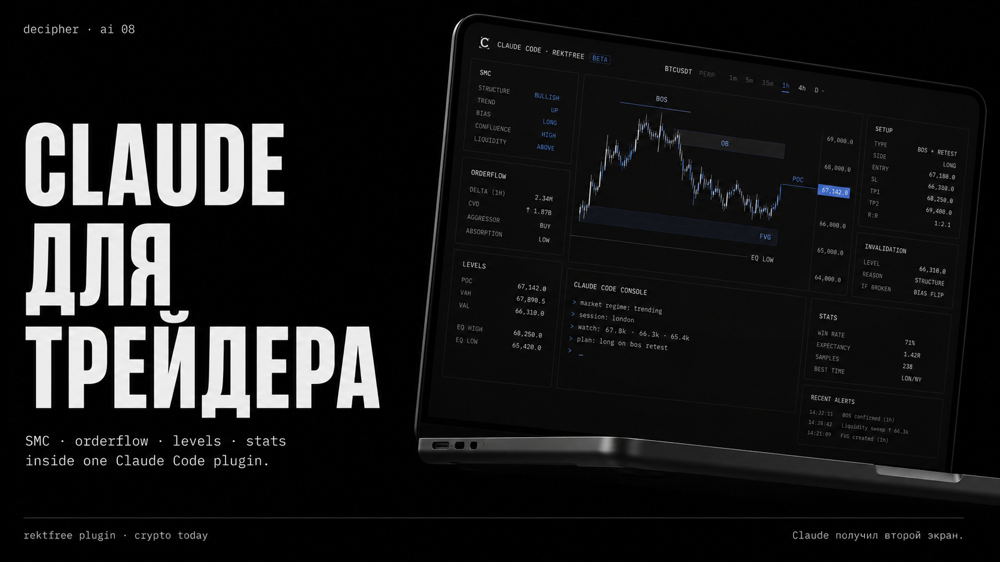
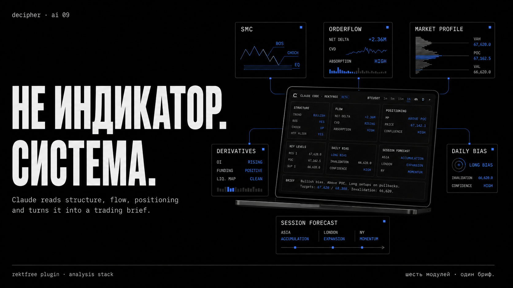
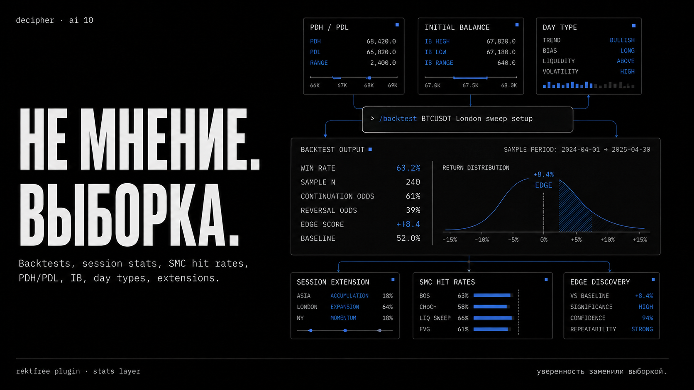
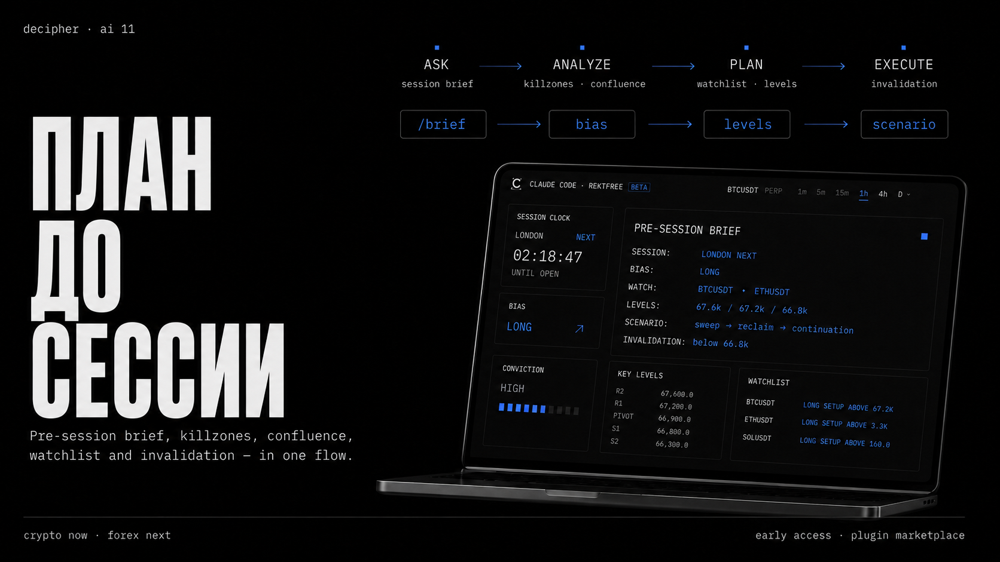

# RektFree Plugin



**Claude for traders.** A self-contained [Claude Code](https://code.claude.com)
plugin for full-stack **crypto, forex, metals & indices** market analysis — **Smart Money
Concepts (SMC)**, **key levels**, **Market Profile**, **order flow**, **confluence
scoring & market scan**, a deep **stats layer** (session / SMC hit-rates / PDH-PDL
/ Initial-Balance / day-type / extension), **daily bias & ICT concepts**, **session
forecasting**, **price-action patterns**, **volatility**, **correlation**,
**futures positioning**, plus an **in-memory backtester** and **edge discovery** —
with **Claude itself as the analyst**.

The plugin ships RektFree's pure-Python analysis engines behind a small MCP
server. Claude calls a tool to fetch live **Binance** (crypto, keyless) or
**OANDA** (forex, metals & stock indices, your token) data, runs the analysis, and interprets the
structure for you. There are no AI-provider API keys to manage — the model you're
already talking to *is* the brain.

### Markets covered

| Market | Venue | Setup | Example symbols |
| --- | --- | --- | --- |
| **Crypto** | Binance (spot + futures) | **Keyless** — no account | `BTCUSDT`, `ETHUSDT`, `SOLUSDT` |
| **Forex** | OANDA | Your `RF_OANDA_TOKEN` | `EUR_USD`, `GBP_USD`, `USD_JPY` |
| **Metals** | OANDA | Same token | `XAU_USD` (gold), `XAG_USD` (silver) |
| **Stock indices** | OANDA | Same token | `NAS100_USD` (Nasdaq), `SPX500_USD` (S&P 500), `US30_USD` (Dow), `DE30_EUR` (DAX), `UK100_GBP` (FTSE), `JP225_USD` (Nikkei) |

The router is convention-based: a separator-free symbol (`BTCUSDT`) goes to
Binance; any underscore symbol (`EUR_USD`, `XAU_USD`, `NAS100_USD`) goes to
OANDA. **One OANDA token unlocks forex, metals *and* indices** — no extra setup.
Indices follow their exchange's hours (not FX's 24/5), so off-hours reads may be
stale.

> **Status: v0.5.** **29 tools** spanning structure, levels, value, flow,
> derivatives, a broad stats layer (session, SMC hit-rates, PDH/PDL, Initial
> Balance, day-type, session-extension, **peak-points HOD/LOD**, **session
> potential cards**, **opening-range breakout**, **ETH value-area touch**),
> daily bias, ICT concepts, session forecasting, price-action patterns,
> volatility, correlation, **position sizing / risk**, **raw candles**, plus an
> **in-memory backtester** (frequency + R-multiple equity curve) and
> **edge-discovery** — and `/analyze`, `/brief`, `/strategy` synthesis layers
> with interpretation skills (multi-timeframe, killzone). **33 commands, 30
> skills.** **Crypto is keyless** (Binance spot +
> futures); **forex, metals & stock indices** (EUR_USD, XAU_USD, NAS100_USD…)
> work with your own OANDA token.
> Install is one step — the server self-bootstraps its deps (see `SETUP.md`).

## Quick start

```text
/plugin marketplace add rektfree-trading/rektfree-plugin
/plugin install rektfree-plugin@rektfree
```

Then just ask ("what's the setup on ETH?") or run a command:

```text
/analyze BTCUSDT      # full multi-factor brief — bias, levels, flow, plan
/scan                 # rank the market for the best setups right now
/brief                # pre-session game plan (session clock + stats + plan)
/smc EUR_USD 1h       # forex/metals too (needs your OANDA token — see SETUP.md)
/smc NAS100_USD 1h    # stock indices too — same OANDA token, no extra setup
/scan indices         # preset watchlist scans: forex / fx / metals / indices
```

First launch auto-installs the server's dependencies (~10–30s). If the very first
connect times out, reconnect once via `/mcp` — every session after is instant.
Full details in [`SETUP.md`](SETUP.md).

## What it looks like

**Not an indicator — a system.** Claude reads structure, flow, and positioning
across the whole analysis stack and turns it into a trading brief:



**Not opinion — a sample.** Backtests, session stats, SMC hit-rates, PDH/PDL,
Initial Balance, day types, extensions, and edge discovery — every read carries a
sample size:



**A plan before the session.** Ask → analyze → plan → execute — pre-session brief,
killzones, confluence, a watchlist, and invalidation, in one flow:



## What you get

| Piece | What it does |
|---|---|
| `analyze_smc` MCP tool | Fetches Binance OHLCV (no API key) and runs the full SMC engine: BOS/CHoCH, order blocks, FVGs, equal highs/lows, liquidity sweeps, breaker blocks, premium/discount range. Returns structured JSON. |
| `get_levels` MCP tool | Fetches Binance 15m candles (no API key) and computes time-based levels: daily/weekly/monthly highs, lows, and opens (current + previous period) plus Asia/London/NY session highs & lows. |
| `get_market_profile` MCP tool | Computes per-session Market Profile / TPO from Binance candles: POC, Value Area (VAH/VAL), and the bucketed letter profile. |
| `get_orderflow` MCP tool | Reconstructs footprint / order flow on the fly from Binance's keyless public aggregated-trades feed: per-price-level buy/sell volume, per-candle delta, running CVD, and large trades. |
| `scan_confluence` MCP tool | Grades a setup with the 0–N Smart Money confluence score across 1H + 4H (requires an aligned order block near price). Deterministic — no AI, no macro/DB inputs. Returns the score, factor breakdown, direction, target, and invalidation. |
| `scan_market` MCP tool | Runs `scan_confluence` across a watchlist concurrently and returns the symbols **ranked** by score — market triage: "any setups right now?" Custom symbol lists, `only_actionable` filter, and an `actionable` count. |
| `compute_session_stats` MCP tool | Statistical edge: scans deep 1H history and reports per-session avg ranges, Asia→London / London→NY **sweep rates**, NY continuation rate, Power-of-3 occurrence, and a day-of-week breakdown (each with sample size). |
| `compute_smc_stats` MCP tool | SMC **hit rates** from a sliding window over 1H history: OB retest & hold rate, FVG fill rate & depth, BOS continuation rate, CHoCH reversal rate, EQH/EQL sweep, and liquidity-sweep success — each with its sample size `n`. |
| `get_derivatives` MCP tool | **Futures positioning** from keyless Binance Futures: funding rate (current %, annualized, next-funding countdown), open interest (value + change/trend), long/short account ratio (**global crowd + top-trader**), and taker buy/sell flow — with trend series for squeeze-risk reads. |
| `get_volatility` MCP tool | **Volatility & range context**: ATR (%), ADR + how much of today's range is used, annualized realized vol, Bollinger-band width / squeeze, and an expansion-vs-contraction state — for position sizing and "is a move coming?" |
| `get_correlations` MCP tool | **Cross-asset correlation**: timestamp-aligned log-return Pearson matrix across a watchlist + each symbol vs BTC, with a recent-vs-older **regime shift** (tightening / decoupling) for confirmation vs diversification. |
| `get_session_clock` MCP tool | Pure UTC **session/killzone clock**: current session & phase, next session + minutes, and the active/next killzone — powers `/brief`. |
| `get_daily_bias` MCP tool | The platform's **daily directional-bias** model (close-through PDH/PDL logic) with historical success rates. |
| `get_ict_concepts` MCP tool | **ICT concepts**: draw-on-liquidity, AMD (accumulation/manipulation/distribution), Judas swings, session bias. |
| `compute_pdh_pdl_stats` MCP tool | How often the **previous-day high/low** is swept, holds, or reverses — with day-of-week and sample size. |
| `compute_ib_stats` MCP tool | **Initial Balance** (first-hour range): breakout rate, which side breaks first, extension distribution, IB-hold rate. |
| `compute_day_type_stats` MCP tool | **Day-type** distribution (trend / range / reversal regimes & ICT archetypes) with per-type range. |
| `compute_session_extension_stats` MCP tool | How often / how far a session **extends beyond the prior session's range** (overshoot multiples), by session. |
| `get_session_forecast` MCP tool | A **frequency-based forecast** for the next session: expected range band, prior-session sweep odds, continuation vs reversal — every probability tied to its `n`. |
| `get_price_action` MCP tool | **Candlestick / price-action patterns** (engulfing, pin bars, dojis, stars, inside/outside bars…) on recent candles + a candle summary. |
| `run_backtest` MCP tool | **In-memory backtester**: "how often does X lead to Y?" Claude maps the question to structured conditions (event type, session, day-of-week, direction…); the tool computes the matching events over recent history and returns outcome rates + day-of-week breakdown, each with `n`. Consistency-checked against the stats tools. |
| `discover_edges` MCP tool | **Edge mining**: grid-searches recent history for the strongest setups and anti-patterns, ranked by `edge_score = (win_rate − baseline) × √n`. Returns top edges + anti-patterns with sample sizes (hypotheses to validate, not guarantees). |
| `backtest_rr` MCP tool | **R-multiple backtest**: first-touch trade simulation (ATR stop, R-target) over recent history → equity curve in R, expectancy, profit factor, win rate, and max drawdown. Stop-priority on ambiguous bars; no fees/slippage modeled. Session-family events (sweeps, continuations). |
| `compute_peak_points_stats` MCP tool | **HOD/LOD by session**: which session prints the day's high vs low — marginal distributions plus the joint HOD×LOD probability matrix ("if Asia made the low, which session makes the high?"), each with `n`. |
| `get_session_card` MCP tool | **Session potential card**: for one session (asia/london/new_york) — bullish/bearish day split, HOD/LOD odds, the clock window its extremes form in, and its breakout tendency vs the prior session. |
| `compute_orb_stats` MCP tool | **Opening-range breakout** stats: first-break side, two-sided-break rate, outcome categories, and extension distribution (as multiples of the opening range). Best on forex/indices; crypto uses a synthetic RTH open. |
| `compute_eth_profile_stats` MCP tool | **Prior-day value touch**: how often the next day touches the previous day's POC / VAH / VAL, with average touch times — a mean-reversion / target read for profile traders. |
| `calc_position_size` MCP tool | **Risk-based sizing**: account equity + risk % + stop → position size, notional, R:R to target, breakeven win-rate, and leverage margin. Can derive an ATR-based stop. Exact for USD-quoted markets (crypto, `*_USD` forex/metals/indices). |
| `get_candles` MCP tool | **Raw OHLCV** primitive: fetch candles (with ISO timestamps) for any supported symbol/timeframe so Claude can read or compute on actual prices. |
| `/analyze` command + `synthesis` skill | The flagship read: orchestrates **all** the tools (HTF + entry-TF SMC, levels, profile, order flow, derivatives, confluence) into one weighted brief — bias, key levels, flow, positioning, session context, a trade idea with target & invalidation, and risks. Auto-activates on "what's the setup / full read / bias / trade idea" questions. |
| `/brief` command + `brief` skill | A forward-looking **pre-session brief**: anchors on the session clock (what session we're in, what's next, the killzone), then wraps `/analyze` + `compute_session_stats` into a session game-plan with statistical tendencies and an if-then watch-list. |
| `/strategy` command + `strategy` skill | **Trade / strategy review**: paste your trades (or describe your approach) and Claude computes your stats, cross-references representative trades against the analysis tools, runs a gap analysis vs the RektFree framework, and returns a critique + improvement plan. |
| Single-tool & interpretation commands | `/smc` `/levels` `/profile` `/orderflow` `/scan` `/market` `/sessions` `/smcstats` `/derivatives` `/volatility` `/correlations` `/dailybias` `/ict` `/pdhpdl` `/ib` `/daytype` `/sessionext` `/forecast` `/priceaction` `/peakpoints` `/sessioncard` `/orb` `/ethprofile` `/mtf` `/killzone` `/backtest` `/backtestrr` `/edges` `/possize` `/candles` — run a tool (or stack tools) and ask Claude for a trader-facing read. |
| Auto-activating skills | One per tool/domain plus interpretation skills — `smc`, `levels`, `tpo`, `orderflow`, `scan`, `sessions`, `smcstats`, `derivatives`, `volatility`, `correlations`, `dailybias`, `ict`, `pdhpdl`, `ib`, `daytype`, `sessionext`, `forecast`, `priceaction`, `peakpoints`, `sessioncard`, `orb`, `ethprofile`, `backtest`, `edges`, `strategy`, **`mtf`** (multi-timeframe), **`killzone`** (session timing), **`forex`** (forex/metals setup) — turning the raw numbers into decision-oriented analysis. |

## Requirements

- **Python 3.10+** on your PATH (`python3`).
- **No manual dependency install** — on first launch the server self-bootstraps
  its deps (`mcp`, `httpx`) into an isolated cache-dir venv. See `SETUP.md`.
- Network access to `api.binance.com` (public, no account) for crypto.
- **Forex, metals & stock indices (optional):** your own OANDA API token via
  `RF_OANDA_TOKEN` — one token covers all three (`EUR_USD`, `XAU_USD`,
  `NAS100_USD`…). See `SETUP.md` or just ask Claude "how do I set up forex?".

## Install

From a Claude Code session:

```
/plugin marketplace add rektfree-trading/rektfree-plugin
/plugin install rektfree-plugin@rektfree
```

Then reload, and try:

```
/smc BTCUSDT 1h
```

…or just ask in plain English: *"What's the SMC structure on ETH right now?"*

## Using the MCP server outside Claude Code

The server speaks standard [MCP](https://modelcontextprotocol.io) over stdio, so
Claude Desktop, Cursor, and other MCP clients can connect to it directly:

```json
{
  "mcpServers": {
    "rektfree": {
      "command": "python3",
      "args": ["/absolute/path/to/rektfree-plugin/mcp-server/server.py"],
      "env": { "PYTHONPATH": "/absolute/path/to/rektfree-plugin/mcp-server" }
    }
  }
}
```

(The slash command and skill are Claude Code-specific; the tool is portable.)

## Layout

```
rektfree-plugin/
  .claude-plugin/
    plugin.json          # plugin manifest
    marketplace.json     # makes this repo installable as a marketplace
  .mcp.json              # registers the stdio MCP server
  commands/              # 33 slash commands (analyze, brief, strategy + one per tool)
  skills/                # 30 skills (synthesis + one per tool/domain),
                         #   each a SKILL.md + reference.md
  mcp-server/
    server.py            # FastMCP server — auto-discovers tools/*.register(mcp)
    requirements.txt     # mcp, httpx  (requirements-dev.txt adds pytest)
    config.py            # optional env config (reserved for forex/OANDA)
    pytest.ini
    tools/               # 29 tool modules, each exposing register(mcp)
      _common.py         #   shared crypto-only guard + bias helper
      …                  #   smc, levels, market_profile, orderflow, confluence,
                         #   scan_market, session_stats, smc_stats, derivatives,
                         #   volatility, correlations, session_clock, daily_bias,
                         #   ict_concepts, pdh_pdl_stats, ib_stats, day_type_stats,
                         #   session_extension_stats, session_forecast, price_action,
                         #   peak_points_stats, session_potential, orb_stats,
                         #   eth_profile_stats, backtest, backtest_rr, edge_discovery,
                         #   position_sizing, get_candles
    engines/             # pure analyzers (vendored from backend where applicable)
    data/
      binance.py         # keyless candle fetcher (+ shared retry/backoff, paged history)
      agg_trades.py      # keyless aggregated-trades fetcher (order flow)
      derivatives.py     # keyless Binance Futures fetchers (funding/OI/long-short/taker)
    tests/               # pytest: offline unit + live contract (RF_LIVE_TESTS=1)
```

`synthesis` has no MCP tool of its own — it's a pure orchestration skill that
calls the other tools and weighs their output. Both data fetchers share one
retry/backoff helper, so transient Binance rate limits (429/418) and 5xx/network
blips are retried automatically rather than surfacing as hard errors.

Each tool lives in its own `tools/<name>.py` exposing `register(mcp)`; the server
auto-discovers them, so adding a tool never touches `server.py`.

## How it works

```
/smc or a question
      │
      ▼
  smc skill ──▶ analyze_smc (MCP tool)
                   │
                   ├─ data/binance.py   fetch OHLCV (keyless)
                   └─ engines/smart_money.py   run SMC analysis
                   │
                   ▼
              structured JSON
                   │
                   ▼
       Claude interprets ──▶ your trader-facing read
```

## Development & tests

The server has a pytest suite under `mcp-server/tests/`:

```bash
cd mcp-server
pip install -r requirements-dev.txt
pytest                  # offline: pure engines, guards, retry logic, session clock
RF_LIVE_TESTS=1 pytest  # also run the live Binance contract tests (network)
```

The offline suite is fully deterministic (no network) and covers the analysis
engines, the data-layer retry/backoff, the shared guards, and the session clock.
The `live`-marked tests hit the public Binance API and assert every registered
MCP tool returns a clean payload end-to-end; they're skipped unless
`RF_LIVE_TESTS=1`.

**Engine-sync note:** the `engines/` analyzers are vendored from the
`rektfree-backend` repo. If those backend services change, re-copy them here and
re-run the suite (see `PLUGIN_STATUS.md` in the backend repo).

## Roadmap

- ~~Forex/metals via OANDA (bring-your-own token)~~ ✅ shipped in v0.3 — set
  `RF_OANDA_TOKEN`; all structural/stat tools route forex→OANDA, crypto→Binance.
- Macro / economic-calendar awareness (would need a public calendar data source).
- Deeper stat history — the on-the-fly stats sample recent 1H history (exchange
  paging); the hosted product uses full history.
